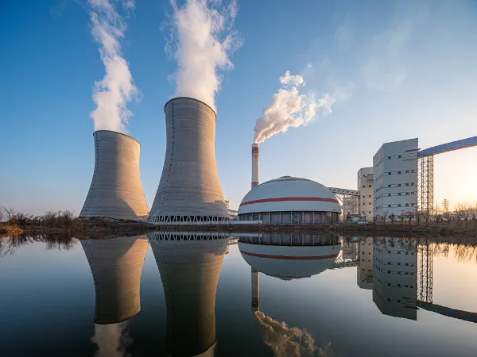
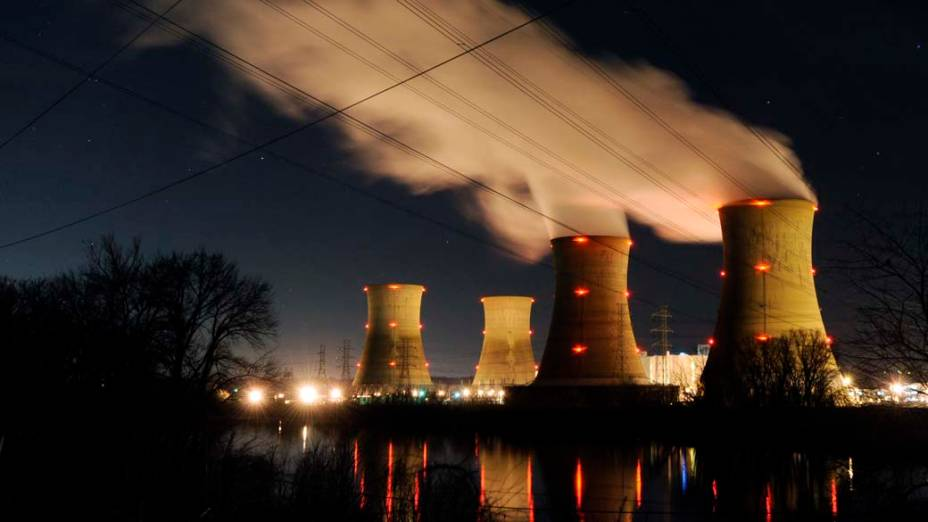
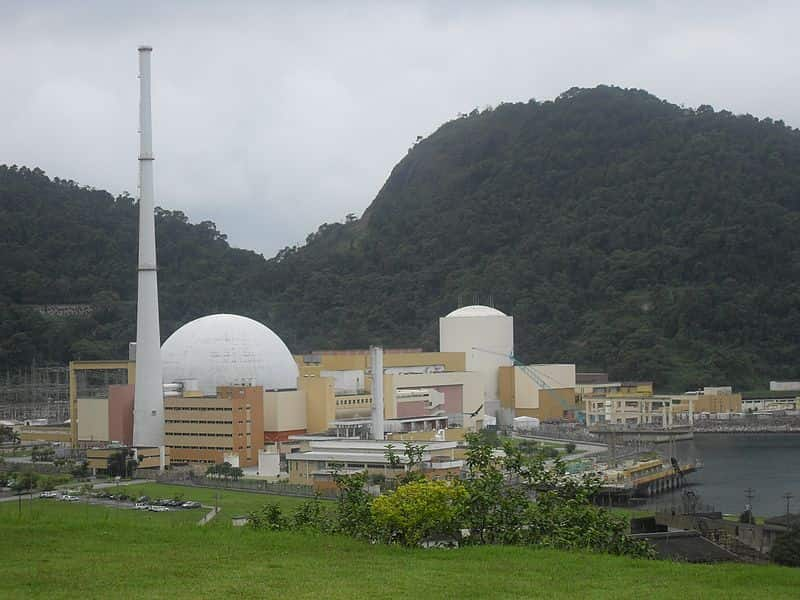

# A energia nuclear

### Introdução 

* Fala, pessoal. Nós somos **David, Pietro e Vinícius** e iremos apresentar um seminário sobre a energia nuclear, uma fonte de energia não-renovável obtida a partir do Urânio.

### E o que é Energia Nuclear?

* A Energia Nuclear, também conhecida como energia atômica, é a energia obtida através do processo de fissão de um **átomo** de grande massa, como o urânio e o plutônio, a partir do choque destes átomos com nêutrons.

* Inicialmente, a Energia Nuclear foi utilizada para fins militares, gerando experiências catastróficas como em Hiroshima e Nagasaki.
    - Foi a base das bombas que devastaram as duas cidades, causando destruição massiva e inúmeras mortes. Elas forneceram explosões de grande potência, liberando radiação e causando incêndios que destruíram grande parte das cidades.

* Na medicina, a tecnologia nuclear é utilizada na **cura** ou **prevenção de câncer**. Na agricultura, a Energia Nuclear é utilizada na **irradiação de alimentos**, visando a esterilização e aumento da vida útil de inúmeros alimentos.

* E apesar das diversas aplicações, a geração de energia elétrica é considerada por muitos o principal benefício do uso da Energia Nuclear. O emprego desse tipo de energia para produção de energia elétrica já representa quase 20% da produção no mundo. 

 
<iframe width="560" height="315" src="https://www.youtube.com/embed/2W4v5_ZVQOA?si=OhwwFHkeMMV7vTJp" title="YouTube video player" frameborder="0" allow="accelerometer; autoplay; clipboard-write; encrypted-media; gyroscope; picture-in-picture; web-share" referrerpolicy="strict-origin-when-cross-origin" allowfullscreen></iframe>

### Mas o que é uma Usina Nuclear?

* É uma instalação que produz energia elétrica por meio de reações de elementos radioativos. 

* Essas usinas funcionam a partir da fissão nuclear, controlada dentro dos reatores. O processo de fissão nuclear libera calor, que aquece a água e a transforma em vapor. Esse vapor por sua vez, gira a turbina, que aciona o gerador, produzindo assim a energia elétrica.

* Possuem alta taxa de produtividade, porque um pequeno volume de matéria-prima é capaz de gerar um absurdo energia. 

### E as vantagens e riscos são... 

* A maior vantagem é o não uso de combustíveis fósseis, evitando a emissão de gases que causam o aquecimento global. 

    - CO2, CH4, N2O, SF6, O3...

* Ocupam áreas pequenas e não dependem de condições ambientais. 

* Possuem algumas contradições, como o **risco de vazamento** do material radioativo usado na operação da usina. 

    - A chance do mesmo acontecer é muita baixa. Caso ocorra, as consequências podem ser desastrosas ao meio ambiente e a vida. 

* Produção de lixo atômico. 
    - Após ser usado, o urânio se transforma em um material superultamegaextremamente radioativo. Desse modo, esse tipo de lixo precisa ser armazenado por centenas de anos, em tambores de chumbo, até se tornar estável. 

### As potências mundiais de energia nuclear

* Os Estados Unidos é o país que possui maior parque nuclear do planeta, com 104 usinas em operação. Em seguida tem-se a França, com 59 reatores, Japão, com 53, Rússia, com 31 e Coréia do Sul, com 20 usinas nucleares em operação. 

<iframe width="560" height="315" src="https://www.youtube.com/embed/EhY___IEwCA?si=EvGLYLlnJFI9iG7h" title="YouTube video player" frameborder="0" allow="accelerometer; autoplay; clipboard-write; encrypted-media; gyroscope; picture-in-picture; web-share" referrerpolicy="strict-origin-when-cross-origin" allowfullscreen></iframe>

 

### E o BR? Como que fica? 

* No Brasil, os projetos para seu uso ganharam força nos governos militares, que tinham a intenção de trazer essa tecnologia pro país. A primeira usina termonuclear inaugurada no país foi a **Angra 1**. Fundada em 1985, essa usina é equipada com um reator norte-americano.

* Em 2000, Angra 2 foi inaugurada, agora com um reator da Alemanha.

### Blz, e a maquete hein

* Nossa maquete foi baseada em uma usina nuclear comum, contendo a *fonte de água*, *torre de refrigeração*, *turbinas*, *condensador*, *bomba d'água*, *reator nuclear*, *usina nuclear*, *rede de distribuição elétrica* e *gerador*. 

Vlw 🙂

FODA :3

